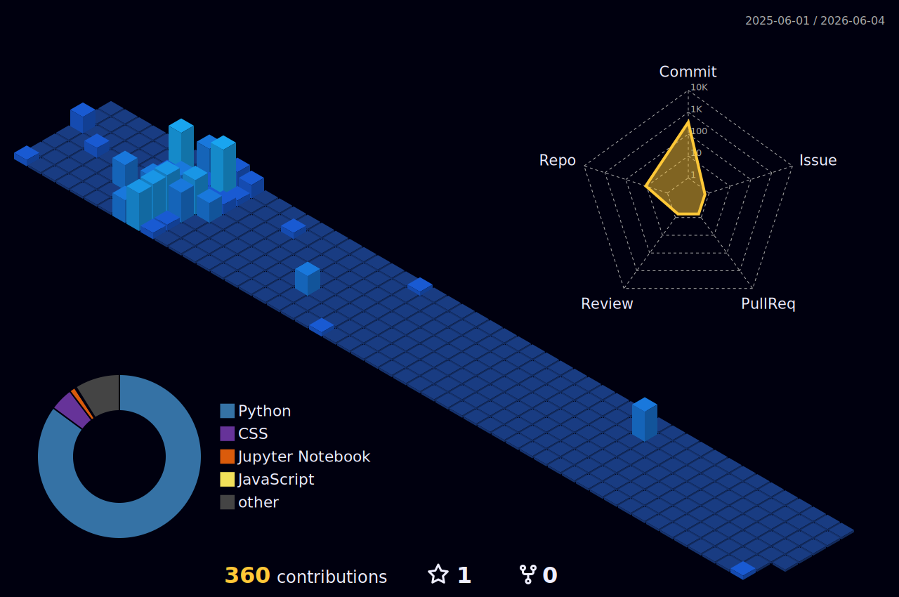

<!-- ═══════════════════════════════════════════════════════════════════════════════ -->
<!--                           🎨 HEADER SECTION                                    -->
<!-- ═══════════════════════════════════════════════════════════════════════════════ -->

  

<!-- Dynamic Typing Effect -->

  

<!-- Profile Badges -->

  
  &nbsp;
  
  &nbsp;
  

<!-- Quick Social Links -->

  
  &nbsp;
  
  &nbsp;
  

 

<!-- ═══════════════════════════════════════════════════════════════════════════════ -->
<!--                           👨‍💻 ABOUT ME SECTION                                 -->
<!-- ═══════════════════════════════════════════════════════════════════════════════ -->

##  &nbsp;About Me

### 🎯 Who am I?

> *A passionate **Machine Learning Engineer** crafting intelligent systems that solve real-world problems.*

- 🎓 **M.Tech (Data Science)** at **NIT Jalandhar** | B.Tech from **RGPV**
- 💼 **Teaching Assistant** for ML & Optimization courses
- 🔬 Former Intern in **Backend, Data Science & ML**
- 🏠 Based in **India** 🇮🇳

### 🚀 What I'm Up To

- 🔭 Building **RAG-powered assistants** using LangChain & LLMs
- 🌱 Deep diving into **ML System Design** & **MLOps**
- 👨‍🏫 Teaching & mentoring aspiring ML engineers
- ✍️ Writing technical blogs to share knowledge

### 🎯 2025 Goals

- 📝 Publish research paper in ML/AI domain
- 🚀 Build & deploy 5 production-ready ML applications
- 🤝 Contribute more to open-source ML projects

 

<!-- ═══════════════════════════════════════════════════════════════════════════════ -->
<!--                           🛠️ TECH STACK SECTION                                -->
<!-- ═══════════════════════════════════════════════════════════════════════════════ -->

## &nbsp; Tech Stack & Skills

<b>🤖 Machine Learning & AI</b>

 

  
  
  
  
  
  
  

<b>📊 Data Science & Analytics</b>

 

  
  
  
  
  
  

<b>☁️ Cloud & DevOps</b>

 

  
  
  
  
  
  

<b>🗄️ Databases & Backend</b>

 

  
  
  
  
  

<b>🌐 Web Development & Tools</b>

 

  
  
  
  
  
  
  

 

<!-- Tech Stack Icons Display -->

  

<!-- ═══════════════════════════════════════════════════════════════════════════════ -->
<!--                           🏆 FEATURED PROJECTS SECTION                          -->
<!-- ═══════════════════════════════════════════════════════════════════════════════ -->

## &nbsp; Featured Projects

<!-- 📌 UPDATE: Replace the GitHub links below with your actual project repository URLs -->

| 🚀 Project | 📝 Description | 🛠️ Tech Stack |
|:-----------|:---------------|:--------------|
| **RAG Assistant** | Intelligent document Q&A system using retrieval-augmented generation | `LangChain` `OpenAI` `Pinecone` `Streamlit` |
| **ML Pipeline Framework** | End-to-end ML pipeline with automated training & deployment | `MLflow` `Docker` `FastAPI` `AWS` |
| **Data Analytics Dashboard** | Interactive visualization dashboard for business insights | `Python` `Plotly` `Streamlit` `SQL` |
| **NLP Text Classifier** | Multi-label text classification using transformer models | `PyTorch` `Transformers` `HuggingFace` |
| **Predictive Analytics Engine** | Time-series forecasting for business metrics | `Prophet` `TensorFlow` `Pandas` `GCP` |

  

<!-- ═══════════════════════════════════════════════════════════════════════════════ -->
<!--                           📊 GITHUB STATS SECTION                              -->
<!-- ═══════════════════════════════════════════════════════════════════════════════ -->

## &nbsp; GitHub Analytics

  
  <!-- Stats Cards Row -->
  

<!-- Streak Stats -->

  

<!-- GitHub Trophies -->

  

<!-- ═══════════════════════════════════════════════════════════════════════════════ -->
<!--                           📈 ACTIVITY SECTION                                  -->
<!-- ═══════════════════════════════════════════════════════════════════════════════ -->

## &nbsp; Coding Activity

<!-- Wakatime Stats -->

  

<!-- Contribution Heatmap -->
<h3 align="center">📅 Contribution Heatmap</h3>

  

 

<!-- Contribution Snake -->
<h3 align="center">🐍 Contribution Snake</h3>

  <picture>
    <source media="(prefers-color-scheme: dark)" srcset="https://raw.githubusercontent.com/Shushant-k1/Shushant-k1/output/github-snake-dark.svg" />
    <source media="(prefers-color-scheme: light)" srcset="https://raw.githubusercontent.com/Shushant-k1/Shushant-k1/output/github-snake.svg" />
    
  </picture>

 

<!-- 3D Contribution Calendar -->
<h3 align="center">🧊 3D Contribution Calendar</h3>

  

<!-- ═══════════════════════════════════════════════════════════════════════════════ -->
<!--                           💡 QUOTE & CONNECT SECTION                           -->
<!-- ═══════════════════════════════════════════════════════════════════════════════ -->

## &nbsp; Random Dev Quote

  

 

<!-- ═══════════════════════════════════════════════════════════════════════════════ -->
<!--                           🤝 CONNECT SECTION                                   -->
<!-- ═══════════════════════════════════════════════════════════════════════════════ -->

## &nbsp; Let's Connect!

  <em>I'm always excited to collaborate on innovative ML projects and discuss new ideas!</em>

  
  &nbsp;&nbsp;
  
  &nbsp;&nbsp;
  
  &nbsp;&nbsp;
  

 

<!-- Support - Remove or update the link if you don't have a Buy Me A Coffee account -->

  

 

<!-- ═══════════════════════════════════════════════════════════════════════════════ -->
<!--                           🎨 FOOTER SECTION                                    -->
<!-- ═══════════════════════════════════════════════════════════════════════════════ -->

  

<!-- Visitor Badge -->

  

